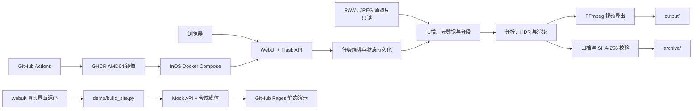

# Solis_Timelapse 设计总览

- 状态：accepted
- 最近核对：2026-08-11

## 目标

Solis_Timelapse 将 RAW/JPEG 照片序列整理为一条本地化、可检查、可取消且可归档的延时摄影工作流：扫描素材、识别分段、分析画面、渲染照片、导出视频，并把源素材、处理配方、分析信息和最终成片组织成可校验归档。

项目优先解决以下问题：

- 原始照片属于用户数据，处理链路不得移动、改名、覆盖或删除它们。
- 分析、渲染、视频和归档都是长任务，需要明确进度、取消边界和发布提交点。
- Windows 本地使用与 fnOS 容器部署共享同一业务实现，但具有不同的路径和认证策略。
- 在线静态演示直接复用真实 WebUI，但只能由合成媒体和浏览器内 Mock API 驱动，不得触达生产后端或用户文件。
- 最终结果需要能够追溯到输入素材、处理参数和完整性校验信息。

## 设计原则

1. **源素材只读**：读取外部照片，写入只发生在应用拥有的工作区、输出和归档目录。
2. **完整后发布**：分析、渲染、视频和归档先在临时位置完成，验证后再替换或发布正式结果。
3. **能力检测而非环境猜测**：GPU/OpenCL/NVENC 在运行时检测，不把硬件存在等同于能力可用。
4. **运行数据与源码分离**：配置覆盖、任务状态、工作文件、成片和归档不进入源码提交。
5. **失败关闭**：路径、挂载、认证状态或输出兼容性无效时，在破坏数据前拒绝继续。
6. **证据约束声明**：自动化测试、静态配置、历史现场验收和当前运行状态分别表述。

## 系统形态

浏览器前端是无构建步骤的 HTML/CSS/JavaScript 应用。Flask API 负责输入校验、媒体访问边界和任务编排；Python 模块负责项目状态、素材目录、图像处理、视频导出和归档。项目不依赖数据库、外部队列、对象存储或云端媒体处理服务。

## 关键边界

### 数据目录

| 类别 | 典型位置 | 所有权与规则 |
| --- | --- | --- |
| 外部输入 | 用户照片目录、容器 `/media/input` | 用户拥有；只读；不得与应用数据目录互相包含 |
| 工作区 | `workspace/`、容器 `/media/workspace` | 应用拥有；保存项目、分析、缩略图、渲染帧和任务状态 |
| 输出 | `output/`、容器 `/media/output` | 应用拥有；保存 MP4 和 HDR 结果 |
| 归档 | `archive/`、容器 `/media/archive` | 应用拥有；保存原片副本、配方、分析、成片和 Manifest |
| 本机配置 | `config/local.yaml` | Windows 本机覆盖；Git 忽略 |
| 容器配置 | `/data/config/config.yaml`、`auth.json` | fnOS 持久化状态；Git 忽略；认证文件不得进入镜像 |

### 运行模式

- **Windows 本地模式**：`run.bat` 管理本机虚拟环境并启动 WebUI，只监听 `127.0.0.1:9501`，保持免登录。
- **fnOS 容器模式**：固定宿主机挂载，输入只读，使用 PUID/PGID 运行，并启用首次管理员初始化和会话登录。
- **镜像发布模式**：GitHub Actions 先执行 Python 测试，再构建并发布 `linux/amd64` GHCR 镜像；默认 Compose 固定到明确的 `sha-*` 标签。
- **静态演示模式**：`demo/build_site.py` 白名单复制 `webui/` 的真实页面、样式和脚本，仅转换生成站点的相对资源路径并在应用脚本前注入 `demo/mock_api.js`；Mock 和合成媒体不属于生产运行时。

## 已采用架构

| 职责 | 实现入口 |
| --- | --- |
| Web 页面、API、路径防护与任务编排 | `webui/server.py`、`webui/index.html`、`webui/app.js` |
| 项目状态原子持久化 | `src/project_store.py` |
| EXIF/元数据扫描与分段 | `src/media_catalog.py` |
| 分析、缩略图、异常候选与渲染 | `src/image_pipeline.py`、`src/image_ops.py` |
| 包围曝光 HDR | `src/hdr_merge.py` |
| 长任务、进度、日志与取消 | `src/task_manager.py` |
| H.264/H.265 视频导出与编码回退 | `src/video_export.py` |
| Manifest、源文件复制和完整性校验 | `src/archive.py` |
| fnOS 应用内管理员认证 | `src/auth.py`、`webui/server.py` |
| 容器路径与启动前校验 | `src/runtime_env.py`、`docker/entrypoint.py` |
| 自动化测试与镜像发布 | `tests/`、`.github/workflows/docker-publish.yml` |
| WebUI 复用型静态演示与 Pages 发布 | `demo/`、`.github/workflows/pages.yml` |

## 可靠性提交点

- 项目 JSON 通过临时文件、同步和替换提交。
- 分析资产写入版本目录，以分析 JSON 作为当前版本提交点。
- 渲染结果在临时目录完整生成后替换当前结果；失败或取消保留上一份完整结果。
- 视频先写临时文件，编码完成后再发布 MP4。
- 归档先复制和校验，再发布带时间戳的归档目录；Manifest 记录交付内容。
- 分析和渲染会再次核对源文件身份，避免扫描后素材变化被静默接受。

## 当前限制

- 容器发布链路只构建 AMD64；ARM64 未验证。
- fnOS 默认通过局域网明文 HTTP 提供服务，不包含 TLS 终止或公网入口。
- Windows 本地模式不提供登录保护，其安全边界是回环地址。
- GPU/OpenCL/NVENC 取决于实际硬件、驱动和容器能力，失败时使用 CPU 路径。
- GitHub Pages 静态演示不执行真实媒体处理、视频编码、文件下载或归档写入，也不能代替 Docker 运行时验收。
- 当前没有公开性能基准、客户案例、覆盖率报告或许可证声明。

## 详细文档

- [架构与集成](docs/architecture.md)
- [fnOS 运行手册](docs/operations/fnos.md)
- [验证与证据](docs/verification.md)
- [中文用户入口](README.md)
- [English user entry](README_EN.md)

## 更新触发条件

架构、目录职责、认证边界、部署方式或外部集成发生变化时，必须同步更新本文件和受影响的详细文档。用户可见行为或运行方式发生变化时，同时更新中英文 README。
