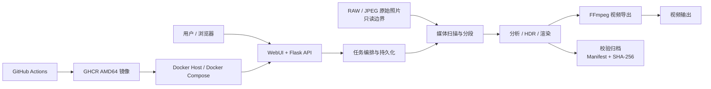
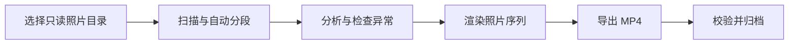

<p align="center">
  
</p>

<h1 align="center">Solis_Timelapse</h1>

<p align="center">
  从 RAW/JPEG 照片序列到可验证视频与归档交付物的本地化延时摄影工作流
</p>

<p align="center">
  <a href="README_EN.md">English</a> ·
  <a href="https://solismuchengxue.github.io/Solis_Timelapse/">在线静态演示</a> ·
  <a href="DESIGN.md">设计总览</a> ·
  <a href="docs/architecture.md">架构</a> ·
  <a href="docs/verification.md">验证证据</a>
</p>

<p align="center">
  <a href="https://github.com/Solismuchengxue/Solis_Timelapse/actions/workflows/docker-publish.yml"></a>
  
  <a href="https://github.com/Solismuchengxue/Solis_Timelapse/pkgs/container/solis_timelapse"></a>
</p>

Solis_Timelapse 把素材扫描、自动分段、画面分析、照片渲染、视频导出和校验归档组织成一条浏览器工作流。它面向需要在本机或 NAS 上处理大量延时照片，又不希望自动化流程改动原始素材的用户。

原始照片始终按只读素材处理。工作文件、成片和归档分别保存，处理链路不会移动、改名、覆盖或删除源照片。

## 项目价值

- **把离散工具连接成完整交付链路**：从照片目录直接进入分段、检查、处理、MP4 和归档，不依赖手工搬运中间文件。
- **让自动化处理具有明确提交点**：分析、渲染、视频和归档完整生成后才发布，失败或取消不覆盖上一份完整结果。
- **让部署与数据边界可追溯**：Windows 本地入口、Docker 容器、GitHub Actions、GHCR 固定镜像和持久化目录各自职责明确。

## 核心能力

| 能力组 | 已实现能力 |
| --- | --- |
| 素材接入与组织 | 递归扫描 RAW/JPEG、读取 EXIF、按时间/焦距/曝光变化分段、代表帧、缩略图、亮度曲线和异常候选 |
| 图像分析与处理 | 坏帧排除、去闪、自然/通透/色彩强化/霞光增强配方、CPU/OpenCL 设备选择、2–9 帧 HDR |
| 视频与归档交付 | H.264/H.265 MP4、NVENC 检测与 CPU 回退、原子输出、Manifest 与 SHA-256 校验归档 |
| 运行与运维 | Flask WebUI、中英文界面、主题、任务进度/日志/取消、Windows 本地模式、Docker 登录、GitHub Actions + GHCR |

## 架构与集成



系统集成了 RAW 解码、EXIF、OpenCV 图像处理、FFmpeg 视频编码、Flask WebUI、Docker Compose 和 GitHub Actions。业务状态保存在本地文件中，不依赖数据库、外部队列、对象存储或云端媒体服务。

详细的组件职责、数据流和技术取舍见 [架构与集成](docs/architecture.md)。

## 关键工作流



1. 选择照片目录并扫描素材。
2. 检查自动分段、代表帧、亮度曲线和异常帧。
3. 调整分段、坏帧和处理配方。
4. 分析并渲染当前分段；长任务显示进度、日志并按阶段支持取消。
5. 设置帧率、分辨率和编码格式，导出 H.264/H.265 MP4。
6. 确认结果后归档源照片副本、配方、分析数据和最终视频。

源照片在整个流程中保持原位。分析和渲染会再次核对源文件身份；结果在完整生成后才发布；归档通过 Manifest、文件大小和 SHA-256 记录交付完整性。

## 工程质量

| 工程主题 | 实现方式 | 自动化证据 |
| --- | --- | --- |
| 源素材保护 | 路径重叠拒绝、容器只读挂载、处理前后源身份核对 | 合成序列端到端测试逐阶段比较源文件 SHA-256 |
| 一致性 | 项目 JSON、分析、渲染和 MP4 使用临时写入与原子发布 | 项目存储、图像管线、视频和归档测试 |
| 长任务可控 | 单活动任务、持久化状态、有界日志、进度和取消边界 | 任务管理与 WebUI API 测试 |
| 编码可回退 | 运行时检查 NVENC，失败时使用 CPU 编码 | H.264/H.265、兼容性、取消和回退测试 |
| 交付可校验 | Manifest、文件数量、大小和 SHA-256 | 归档单元测试与完整端到端流程 |
| 部署可追溯 | 测试后构建镜像，Compose 固定 `sha-*` 标签 | GitHub Actions 与 Docker 静态契约 |

当前测试源码包含 251 个 Python `unittest` 测试方法，并包含一条使用 24 张合成 JPEG 的扫描 → 处理 → 导出 → 归档端到端测试。测试范围和“已验证/未验证”边界见 [验证与证据](docs/verification.md)。

## 快速开始

### Windows 本地运行

要求 Python 3.12：

1. 安装 Python 3.12，并勾选 `Add Python to PATH`。
2. 双击项目根目录的 `run.bat`。
3. 首次启动会创建 `.venv` 并安装仓库声明的依赖。
4. 浏览器打开 `http://127.0.0.1:9501/`。

关闭启动窗口会停止 WebUI。Windows 双击 `run.bat` 的本地模式保持原有的免登录行为，服务只监听回环地址。

### 在线静态演示

[打开在线静态演示](https://solismuchengxue.github.io/Solis_Timelapse/)。演示直接复用真实 WebUI，通过浏览器内 Mock API 和合成数据展示分段、帧检查、亮度曲线、渲染、导出与归档流程；它不启动 Flask 后端、不读取真实文件，也不生成真实视频或归档。

### Docker 部署

部署时直接使用 GitHub Actions 发布的 GHCR 镜像，不需要在 Docker 主机上构建源码：

```text
ghcr.io/solismuchengxue/solis_timelapse:sha-887a557
```

准备 `/srv/solis_timelapse`，放入仓库的 `compose.yaml` 和 `.env`，并创建 `workspace`、`output`、`archive`、`config` 四个持久化目录。`.env` 至少包含：

```dotenv
INPUT_PATH=/srv/timelapse/input
APP_ROOT=/srv/solis_timelapse
PUID=1000
PGID=1000
```

原始照片在容器中挂载为 `/media/input:ro`。确认路径和 UID/GID 后执行：

```bash
cd /srv/solis_timelapse
docker compose config
docker compose pull
docker compose up -d
docker compose ps
```

浏览器访问 `http://DOCKER-HOST:9501/`。首次访问会显示“初始化管理员”，后续访问进入登录页。

忘记密码时，在可信 Docker 主机上备份并重置 `/srv/solis_timelapse/config/auth.json`：

```bash
cd /srv/solis_timelapse
mv config/auth.json config/auth.json.bak
docker compose restart
```

## WebUI 使用提示

- “选择要合并分段”只用于两个及以上连续分段；渲染、导出、预览和归档始终作用于当前分段。
- “最终导出”可设置帧率、分辨率、编码格式和质量，并显示当前任务状态。
- “设置 → 处理 → RAW/JPEG 渲染设备”支持自动、CPU 和 GPU；实际设备、并行数和编码器写入任务日志。
- 主题支持白天、夜间和跟随系统；界面支持中文与 English 即时切换。
- 日常使用建议日志级别 `INFO`；排障时使用 `DEBUG` 查看逐帧进度、参数和异常堆栈。

### HDR 合成

1. 在同一分段选择 2–9 张照片并发送到 HDR 页面。
2. “曝光融合”适合多数包围曝光；“辐射 HDR”要求每张照片具有有效快门 EXIF。
3. 调整对齐、运动抑制、融合权重或色调映射后开始合成。
4. 结果保存到 `output/hdr/`；JPEG 适合直接查看，16 位 TIFF 适合继续精修。

HDR 最适合同一机位、短时间内拍摄的包围曝光。云层、树叶或人物移动可能产生重影，需要提高运动抑制或选择时间更接近的照片。

## 输出与归档

MP4 保存到 `output/`，HDR 保存到 `output/hdr/`。归档结构示例：

```text
archive/YYYY-MM-DD_HHMMSS/
  manifest.json
  project.json
  Segment 01/
    originals/
      *.ARW / *.JPG
    recipe.json
    analysis.json
  output/
    Segment 01.mp4
```

归档复制当前分段的源照片、处理配方、分析数据和登记的最终 MP4，并核对文件大小与 SHA-256。它不会移动或删除外部源照片，也不会自动清除当前项目或 `output/` 中的成片。

归档不会把处理产生的 JPEG 或低码率预览视频作为最终成果。归档历史会显示源文件范围、焦距、拍摄时间和可用的 EXIF GPS 信息；删除单条或全部归档会永久删除对应归档副本与最终视频，操作前会再次确认。

“清除当前项目”只清除 `workspace/` 中的当前状态、处理结果和 `output/` 中的当前输出，不会自动归档，也不会删除外部源照片或 `archive/` 中的既有成果。

## 当前限制与安全边界

- GitHub Actions 当前只构建 `linux/amd64` 镜像，ARM64 未验证。
- Docker 发布的 `9501` 端口仍是明文 HTTP，只适合可信网络；不要直接暴露到公网。
- 应用内登录不能替代 HTTPS、宿主机权限、网络访问控制和备份。
- Windows 本地模式不启用登录，其安全边界是 `127.0.0.1`。
- OpenCL/NVENC 取决于硬件、驱动和容器配置；不可用时回退 CPU。
- 在线静态演示只使用合成数据，不执行真实媒体处理、视频编码、文件下载或归档写入。
- 项目目前没有公开性能基准、客户案例、覆盖率报告或许可证声明。

## 项目文档

- [设计总览](DESIGN.md)：目标、原则、系统形态、边界和已采用架构。
- [架构与集成](docs/architecture.md)：组件职责、数据流、集成对象和技术取舍。
- [验证与证据](docs/verification.md)：测试矩阵、验证命令和证据边界。
- [English README](README_EN.md)：面向英文读者的对等项目入口。
