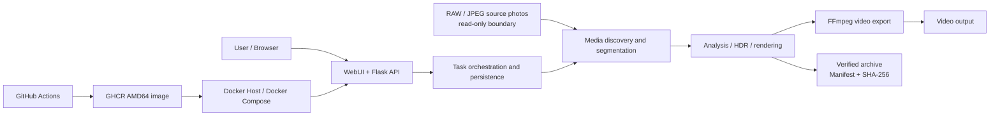
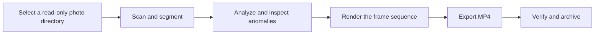

<p align="center">
  
</p>

<h1 align="center">Solis_Timelapse</h1>

<p align="center">
  A local-first timelapse workflow from RAW/JPEG sequences to verifiable video and archive deliverables
</p>

<p align="center">
  <a href="README.md">简体中文</a> ·
  <a href="https://solismuchengxue.github.io/Solis_Timelapse/">Live Static Demo</a> ·
  <a href="DESIGN.md">Design Overview</a> ·
  <a href="docs/architecture.md">Architecture</a> ·
  <a href="docs/verification.md">Verification</a>
</p>

<p align="center">
  <a href="https://github.com/Solismuchengxue/Solis_Timelapse/actions/workflows/docker-publish.yml"></a>
  
  <a href="https://github.com/Solismuchengxue/Solis_Timelapse/pkgs/container/solis_timelapse"></a>
</p>

Solis_Timelapse connects media discovery, automatic segmentation, image analysis, frame rendering, video export, and verified archiving in one browser-based workflow. It is designed for users who process large timelapse photo sets locally or on a NAS and do not want automation to mutate their original media.

Original photos remain read-only inputs. Work files, exported media, and archives live in separate directories; the processing pipeline does not move, rename, overwrite, or delete source photos.

## Project Value

- **A complete delivery path instead of disconnected utilities:** move from a photo directory to segments, review, processing, MP4 output, and an archive without manually shuffling intermediate files.
- **Explicit commit points for long-running work:** analysis, renders, videos, and archives are published only after a complete result is available, so a failure or cancellation does not replace the previous complete result.
- **Traceable runtime and data boundaries:** Windows, Docker containers, GitHub Actions, pinned GHCR images, and persistent data directories each have a defined responsibility.

## Core Capabilities

| Capability | Implemented behavior |
| --- | --- |
| Media intake and organization | Recursive RAW/JPEG discovery, EXIF metadata, time/focal-length/exposure segmentation, representative frames, thumbnails, luminance charts, and anomaly candidates |
| Image analysis and processing | Frame rejection, deflicker, grading recipes, CPU/OpenCL device selection, and 2–9 frame HDR composition |
| Video and archive delivery | H.264/H.265 MP4, NVENC detection with CPU fallback, atomic output publication, manifests, and SHA-256 archive verification |
| Runtime and operations | Flask WebUI, Chinese/English UI, themes, task progress/logs/cancellation, Windows local mode, Docker authentication, and GitHub Actions + GHCR delivery |

## Architecture and Integrations



The system integrates RAW decoding, EXIF extraction, OpenCV image processing, FFmpeg encoding, a Flask WebUI, Docker Compose, and GitHub Actions. Application state is file-based; no database, external queue, object store, or cloud media processor is required.

See [Architecture and Integrations](docs/architecture.md) for component ownership, data flow, and engineering trade-offs.

## End-to-End Workflow



1. Select a source directory and scan the media.
2. Review suggested segments, representative frames, luminance, and anomalies.
3. Adjust segments, rejected frames, and processing recipes.
4. Analyze and render the current segment while progress and logs are reported.
5. Select frame rate, resolution, and codec, then export H.264/H.265 MP4.
6. Archive source copies, recipes, analysis data, and registered final videos.

Sources stay in place throughout the workflow. Analysis and rendering re-check source identity, completed results are published atomically, and archives record file size and SHA-256 evidence in a manifest.

## Engineering Quality

| Concern | Implementation | Automated evidence |
| --- | --- | --- |
| Source protection | Root-overlap rejection, read-only container mount, and source identity checks | End-to-end synthetic sequence test compares source SHA-256 after every stage |
| Consistent state | Temporary writes and atomic publication for project JSON, analysis, renders, and MP4 | Project store, image pipeline, video export, and archive tests |
| Controlled long jobs | One active task, persisted state, bounded logs, progress, and cancellation boundaries | Task manager and WebUI API tests |
| Encoder fallback | Runtime NVENC detection with CPU fallback | H.264/H.265, compatibility, cancellation, progress, and fallback tests |
| Verifiable delivery | Manifest, file-count, size, and SHA-256 checks | Archive unit tests and the full end-to-end workflow |
| Traceable deployment | Image build follows tests; Compose pins a `sha-*` tag | GitHub Actions and Docker contract tests |

The current test source contains 251 Python `unittest` methods, including an end-to-end scan → process → export → archive workflow built from 24 synthetic JPEG frames. See [Verification and Evidence](docs/verification.md) for the test matrix and the boundary between repository, automated, and runtime evidence.

## Quick Start

### Windows Local Mode

Python 3.12 is required:

1. Install Python 3.12 and select `Add Python to PATH`.
2. Double-click `run.bat` in the repository root.
3. On first launch, the script creates `.venv` and installs the declared dependencies.
4. Open `http://127.0.0.1:9501/`.

Closing the launcher window stops the WebUI. Windows local mode remains unauthenticated and listens only on the loopback interface.

### Live Static Demo

[Open the Live Static Demo](https://solismuchengxue.github.io/Solis_Timelapse/). It reuses the real WebUI with an in-browser Mock API and synthetic data to demonstrate segmentation, frame inspection, luminance analysis, rendering, export, and archive workflows. It does not run the Flask backend, read real files, or create real videos or archives.

### Docker Deployment

Deploy the GHCR image produced by GitHub Actions without building the repository on the Docker host:

```text
ghcr.io/solismuchengxue/solis_timelapse:sha-887a557
```

Prepare `/srv/solis_timelapse`, place `compose.yaml` and `.env` there, and create the persistent `workspace`, `output`, `archive`, and `config` directories. `.env` must include:

```dotenv
INPUT_PATH=/srv/timelapse/input
APP_ROOT=/srv/solis_timelapse
PUID=1000
PGID=1000
```

The source directory is mounted as `/media/input:ro`. After replacing the example paths and IDs with real values, run:

```bash
cd /srv/solis_timelapse
docker compose config
docker compose pull
docker compose up -d
docker compose ps
```

Open `http://DOCKER-HOST:9501/`. The first visit displays the administrator setup page; later visits require a login.

To reset a forgotten password on a trusted Docker host, back up and remove `/srv/solis_timelapse/config/auth.json`:

```bash
cd /srv/solis_timelapse
mv config/auth.json config/auth.json.bak
docker compose restart
```

## WebUI Notes

- Segment multi-select is only for merging two or more adjacent segments; render, preview, export, and archive actions operate on the current segment.
- Final export exposes frame rate, resolution, codec, quality, task status, and progress.
- `Settings → Processing → RAW/JPEG render device` supports automatic, CPU, and GPU selection; the selected device, worker count, and encoder are recorded in task logs.
- Themes include light, dark, and system; the interface can switch between Chinese and English immediately.
- Use `INFO` for normal operation and `DEBUG` when frame-level progress, parameters, or stack traces are required.

### HDR Composition

1. Select 2–9 photos from the same segment and send them to the HDR page.
2. Exposure fusion fits most bracketed sets; radiance HDR requires valid shutter-speed EXIF for every frame.
3. Configure alignment, deghosting, fusion weights, or tone mapping, then run the merge.
4. Results are stored under `output/hdr/`; JPEG is intended for direct viewing, while 16-bit TIFF is suited to further editing.

HDR works best for bracketed frames captured from the same position over a short interval. Moving clouds, foliage, or people can produce ghosting; increase deghosting or choose frames closer in time.

## Outputs and Archives

MP4 files are stored under `output/`, and HDR images under `output/hdr/`. Example archive layout:

```text
archive/YYYY-MM-DD_HHMMSS/
  manifest.json
  project.json
  Segment 01/
    originals/
      *.ARW / *.JPG
    recipe.json
    analysis.json
  output/
    Segment 01.mp4
```

An archive copies the selected segment's source photos, recipe, analysis data, and registered final MP4, then checks file sizes and SHA-256 values. It does not move or delete external sources, and it does not automatically clear the current project or exported files.

Processed JPEG frames and low-bitrate preview videos are not treated as final archive deliverables. Archive history shows the source range, focal length, capture time, and available EXIF GPS data. Deleting one or all archive records permanently removes the corresponding archived copies and final videos after confirmation.

“Clear current project” removes current state and processing results from `workspace/` plus current outputs from `output/`. It does not create an archive and does not delete external sources or existing entries under `archive/`.

## Current Limitations and Security Boundary

- GitHub Actions currently builds `linux/amd64` only; ARM64 has not been validated.
- Docker publishes port `9501` over plain HTTP; keep it on a trusted network and do not expose it directly to the public internet.
- Application login does not replace HTTPS, host permissions, network access control, or backups.
- Windows local mode has no login; its security boundary is `127.0.0.1`.
- OpenCL and NVENC depend on hardware, drivers, and container configuration; the application falls back to CPU when unavailable.
- The static demo uses synthetic data only and performs no real media processing, video encoding, downloads, or archive writes.
- The project currently has no public performance benchmark, customer case study, coverage report, or declared license.

## Project Documentation

- [Design Overview](DESIGN.md): goals, principles, system shape, boundaries, and adopted architecture.
- [Architecture and Integrations](docs/architecture.md): components, data flow, integrations, and trade-offs.
- [Verification and Evidence](docs/verification.md): test matrix, commands, and evidence boundaries.
- [中文 README](README.md): the default Chinese project entry.
