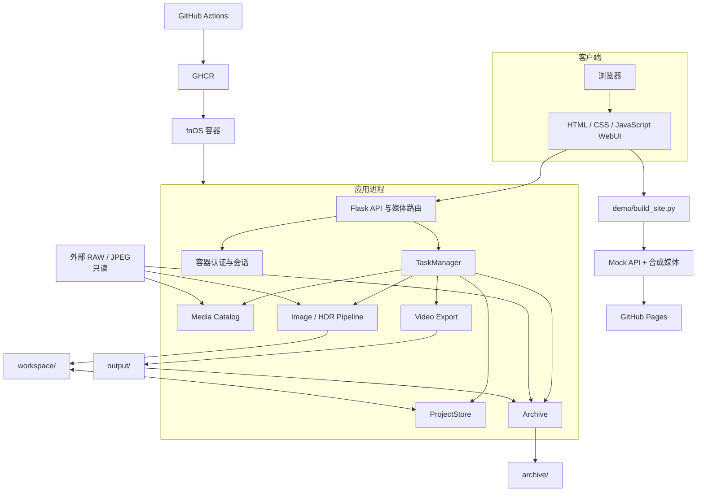
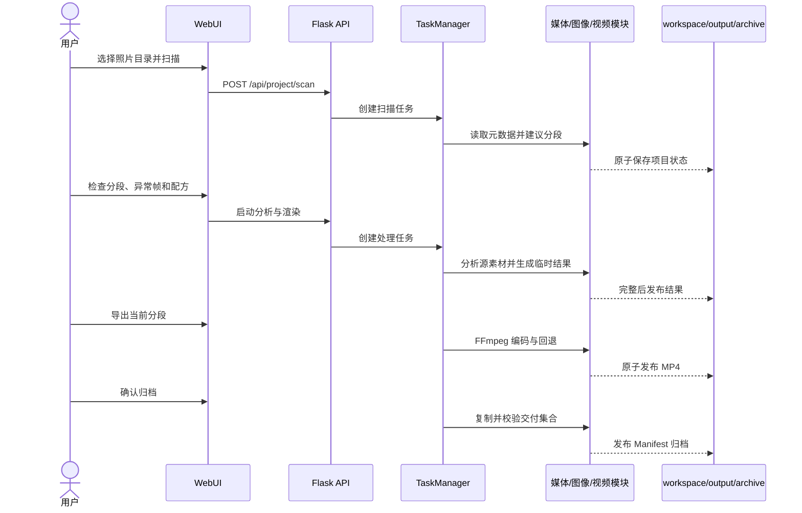

# 架构与集成

- 状态：accepted
- 最近核对：2026-08-11
- 设计入口：[DESIGN.md](../DESIGN.md)

## 1. 系统范围

Solis_Timelapse 是本地优先的延时摄影处理系统。系统读取用户选择的 RAW/JPEG 照片，建立项目和分段，生成分析资产与处理后的 JPEG 序列，通过 FFmpeg 导出视频，并按需建立包含原片副本、配方、分析和最终成片的归档。

生产处理系统范围不包含照片采集、云端同步、团队协作、外部数据库、对象存储、TLS 终止或第三方身份提供商。GitHub Pages 只托管复用 WebUI 的合成数据静态演示，不属于生产处理系统。

## 2. 组件关系

## 3. 组件职责

### WebUI 与 Flask API

`webui/index.html`、`webui/app.js` 和 `webui/ui_prefs.js` 提供工作台、设置、HDR、历史、主题和中英文界面。`webui/server.py` 负责：

- JSON API 与静态资源服务；
- 当前项目、分段和任务的编排；
- 输入目录和运行目录重叠检查；
- 当前结果与归档媒体的白名单访问；
- 本地与容器运行策略切换；
- fnOS 管理员初始化、登录、退出和会话保护。

媒体路由不会把客户端路径直接拼接到文件系统。候选路径必须解析在允许根目录内，并满足当前项目或 Manifest 的登记范围。

### 静态演示链路

`demo/build_site.py` 从 `webui/` 白名单组装 `.demo-site/`：`styles.css`、`ui_prefs.js` 与 `app.js` 逐字节复用，只在生成的 `index.html` 中改写相对资源路径并提前注入 `demo/mock_api.js`。Mock API 返回与 Flask API 相同的核心响应形状，使用 12 张合成图片和内存状态模拟扫描、渲染、导出、归档与重置。

静态演示与 Flask API 明确隔离：同源 API 请求由 Mock 拦截，未知操作失败关闭，跨源请求返回拒绝；它不读取用户文件、不运行 Python 媒体管线、不生成视频、不下载结果、不写归档。`.demo-site/` 仅是被 Git 忽略的构建产物，Pages 工作流只上传该目录。

### 项目与任务状态

`src/project_store.py` 保存当前项目、分段、配方、分析状态、渲染状态和导出记录。写入采用临时文件、`fsync` 和 `os.replace`，避免半写 JSON 成为当前状态。

`src/task_manager.py` 只允许一个活动任务，持久化进度和有界日志，并区分排队、运行、取消中、完成、失败和取消状态。不同处理步骤按照自身提交点响应取消。

### 素材目录与分段

`src/media_catalog.py` 递归发现支持的 RAW/JPEG 文件，读取 EXIF 或文件时间，并按时间间隔、焦距和曝光变化建议分段。递归目录中的同名文件使用完整路径作为内部身份，输出命名在整个分段范围内确定，避免 FFmpeg 排序改变时间线。

### 图像分析、HDR 与渲染

`src/image_pipeline.py` 和 `src/image_ops.py` 负责：

- 亮度测量与去闪参数；
- 缩略图、代表帧和异常候选；
- RAW 解码和 JPEG 读取；
- 曝光、色彩与霞光增强；
- CPU 并行数选择与 OpenCL 能力检测；
- 源文件身份复核；
- 临时结果生成和原子发布。

`src/hdr_merge.py` 对 2–9 张同分段照片执行自动对齐、曝光融合或辐射 HDR、运动抑制和结果保存，输出 JPEG 或 16 位 TIFF。

### 视频交付

`src/video_export.py` 通过 imageio-ffmpeg 定位 FFmpeg，生成 H.264/H.265 MP4。导出前验证帧和编码参数；NVENC 可用时优先使用硬件编码，初始化或执行失败时回退 CPU 编码。视频写入临时路径，成功后才替换正式输出。

### 归档交付

`src/archive.py` 为选中分段复制原始照片、处理配方、分析信息和登记的最终视频。发布前校验源文件和目标副本的大小及 SHA-256，并写入 `manifest.json`。归档不会删除外部源照片，也不会自动删除当前项目或 `output/` 成片。

## 4. 端到端工作流

## 5. 外部集成

| 集成 | 用途 | 边界与回退 |
| --- | --- | --- |
| rawpy | RAW 解码 | 仍由 CPU 解码；不写源文件 |
| ExifRead / Pillow | EXIF、JPEG 和缩略图 | 缺失元数据时使用明确的未知值或文件时间，不伪造 EXIF |
| NumPy / OpenCV | 图像分析、处理、HDR、OpenCL | OpenCL 不可用时回退 CPU |
| imageio-ffmpeg / FFmpeg | MP4 编码 | NVENC 不可用或失败时回退 CPU 编码 |
| Flask | WebUI API、会话和媒体服务 | Windows 只监听回环；容器模式启用认证 |
| Docker Compose | fnOS 运行与挂载 | 输入强制 `:ro`；数据目录必须显式持久化 |
| GitHub Actions / GHCR | 测试、镜像构建和发布 | 构建依赖测试 Job；当前只发布 AMD64 |
| GitHub Actions / Pages | 复用 WebUI 的公开静态演示 | 只上传 `.demo-site/`；Mock 和合成媒体与生产 Flask 运行时隔离 |

## 6. 关键取舍

### 本地优先而非云端处理

照片体积大且属于用户私有素材。本地处理减少上传依赖并保持目录所有权清晰，代价是性能和硬件能力受运行设备影响，远程访问需要用户另行提供安全入口。

### 单活动任务而非并行队列

单任务模型降低内存、显存、磁盘提交点和用户操作状态的复杂度，适合单用户工作台。代价是不能同时渲染多个项目或分段。

### 一次最终渲染而非多级有损中间件

分析阶段生成参数和轻量资产，最终渲染从源文件解码并在内存合并调整，减少重复 JPEG 编码。代价是修改配方后需要重新渲染结果。

### 固定镜像标签而非默认漂移

fnOS Compose 固定 `sha-*` 标签，使部署内容可以追溯到明确提交。升级需要显式修改 Compose 并重新拉取，换取更可控的回退路径。

## 7. 安全与可靠性边界

- 源照片目录与 `workspace`、`output`、`archive` 不能互相包含。
- 容器输入以 `/media/input:ro` 挂载，运行数据使用独立宿主机目录。
- fnOS 认证文件只保存 scrypt 密码哈希和会话密钥，并尝试设置为 `0600`。
- 认证状态损坏时容器模式失败关闭；健康检查仍可用于容器编排。
- fnOS 默认端口是局域网明文 HTTP，不得直接暴露到公网。
- 路径校验、应用内登录和只读挂载不能替代宿主机权限、备份、TLS 或网络访问控制。

## 8. 验证入口与更新规则

测试矩阵和证据边界见 [验证与证据](verification.md)。架构、数据目录、认证、部署或外部集成发生变化时，必须同时更新本文件、[DESIGN.md](../DESIGN.md) 和受影响的中英文 README。
